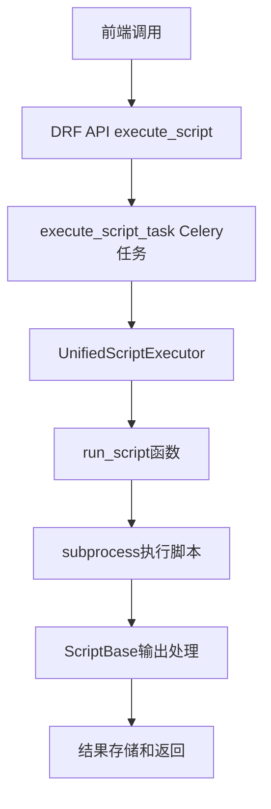

# Celery Views 统一脚本执行器文档

## 📋 概述

本文档详细说明了统一脚本执行器的架构和使用方法。系统已从传统的"传统脚本"和"动态脚本"双执行器架构升级为统一的脚本执行器架构。

## 🏗️ 统一架构

### 核心组件

1. **execute_script_task**: 统一的Celery异步任务
2. **UnifiedScriptExecutor**: 统一脚本执行器
3. **ScriptExecutorBase**: 脚本执行基类
4. **TaskExecutionManager**: 任务状态管理器
5. **ResourceMonitor**: 资源监控器

### 执行流程



## 🔄 主要功能

### 1. 统一脚本执行器 (execute_script_task)
- 支持所有类型的脚本执行
- 完整的错误处理和重试机制
- 资源监控和性能统计

### 2. DRF ViewSets
- ScriptViewSet: 脚本管理
- PageScriptConfigViewSet: 页面脚本配置
- TaskExecutionViewSet: 任务执行记录

### 3. REST API接口
- 脚本执行API
- 任务状态查询API
- 脚本配置管理API

## 📝 架构设计

- 采用统一执行器架构
- 支持subprocess进程隔离
- 完整的任务生命周期管理
- 与Django ORM深度集成

## 🚀 使用场景

- 前端页面脚本按钮执行
- 动态脚本参数配置
- 批量任务处理
- 系统监控和日志

### 2. 🔧 导入依赖库分类

#### 原始导入
```python
from rest_framework.decorators import api_view
from rest_framework import status
import logging
# ... 其他导入
```

#### 优化后导入
```python
# ============================================================================
# 导入依赖库
# ============================================================================

# Django核心模块
from django.http import JsonResponse
from django.views.decorators.csrf import csrf_exempt
# ...

# Django REST Framework
from rest_framework import viewsets, status
from rest_framework.decorators import action, api_view
# ...

# Celery异步任务框架
from celery import shared_task
from celery.utils.log import get_task_logger
# ...

# 系统标准库
import logging
import json
import subprocess
# ...

# 项目内部模块
from ..models import Script, TaskExecution, PageScriptConfig, ScanDevUpdate_scanResult
# ...
```

### 3. 🚀 核心任务执行器注释

#### execute_python_script 函数
```python
@shared_task(bind=True)
def execute_python_script(self, task_execution_id, script_id, parameters, user_id, page_context):
    """
    统一任务执行器 - 执行Python脚本任务
    
    这是AutoTest系统的核心任务执行器，负责：
    1. 执行Python和Shell脚本
    2. 监控任务执行状态和资源使用
    3. 处理错误和重试机制
    4. 保存执行结果到数据库
    
    参数:
    -----
    task_execution_id : int
        任务执行记录ID，用于更新执行状态
    script_id : int
        脚本ID，从Script表获取脚本配置
    parameters : dict
        脚本执行参数，通过环境变量传递给脚本
    user_id : int
        执行用户ID，用于权限控制和审计
    page_context : str
        页面上下文，标识任务来源页面
        
    返回:
    -----
    dict : 任务执行结果
        - status: 'success' 或 'error'
        - result: 脚本执行结果数据
        - execution_time: 执行耗时(秒)
        - memory_usage: 内存使用量(MB)
        - script_name: 脚本名称
        
    异常处理:
    --------
    - 自动重试机制：最多重试3次，间隔60秒
    - 超时处理：脚本执行超过540秒自动终止
    - 资源监控：记录内存和CPU使用情况
    - 错误日志：完整的错误堆栈和上下文信息
    """
```

### 4. 🔄 脚本执行核心逻辑注释

#### run_script 函数
```python
def run_script(script_path, parameters, page_context, script_name):
    """
    运行脚本的核心逻辑 - 统一脚本执行入口
    
    此函数是脚本执行的核心调度器，负责：
    1. 验证脚本文件存在性
    2. 处理相对路径和绝对路径
    3. 根据文件类型分发到对应的执行器
    4. 提供统一的错误处理
    
    参数:
    -----
    script_path : str
        脚本文件路径（支持相对路径和绝对路径）
    parameters : dict
        脚本执行参数，通过环境变量传递
    page_context : str
        页面上下文，标识调用来源
    script_name : str
        脚本名称，用于日志记录
        
    返回:
    -----
    dict : 脚本执行结果
        包含脚本输出的JSON数据或文本内容
        
    异常:
    ----
    FileNotFoundError : 脚本文件不存在
    ValueError : 不支持的脚本类型
    RuntimeError : 脚本执行失败
    """
```

### 5. 🐍 Python脚本执行器注释

#### run_python_file 函数
```python
def run_python_file(script_path, parameters, page_context, script_name):
    """
    运行Python文件 - 增强版Python脚本执行器
    
    此函数负责执行Python脚本，提供：
    1. 环境变量传递参数
    2. 进程隔离和超时控制
    3. 输出解析和格式化
    4. 完整的错误处理
    
    参数:
    -----
    script_path : str
        Python脚本文件路径
    parameters : dict
        脚本参数，通过环境变量传递
    page_context : str
        页面上下文信息
    script_name : str
        脚本名称
        
    返回:
    -----
    dict : 脚本执行结果
        - 如果脚本输出JSON，直接返回解析后的数据
        - 如果脚本输出文本，包装为统一格式
        
    环境变量:
    --------
    SCRIPT_PARAMETERS : str
        JSON格式的参数字符串
    PAGE_CONTEXT : str
        页面上下文
    SCRIPT_NAME : str
        脚本名称
    EXECUTION_ID : str
        执行ID（时间戳）
    """
```

### 6. 🎯 DRF ViewSets 注释

#### ScriptViewSet
```python
class ScriptViewSet(viewsets.ModelViewSet):
    """
    脚本管理ViewSet
    
    提供脚本的CRUD操作：
    - GET /api/scripts/ - 获取脚本列表
    - POST /api/scripts/ - 创建新脚本
    - GET /api/scripts/{id}/ - 获取脚本详情
    - PUT /api/scripts/{id}/ - 更新脚本
    - DELETE /api/scripts/{id}/ - 删除脚本
    
    权限要求：需要用户认证
    """
```

#### PageScriptConfigViewSet
```python
class PageScriptConfigViewSet(viewsets.ReadOnlyModelViewSet):
    """
    页面脚本配置ViewSet（只读）
    
    提供页面脚本配置的查询操作：
    - GET /api/page-script-configs/ - 获取所有页面配置
    - GET /api/page-script-configs/?page_route=/scanDevUpdate - 获取特定页面的配置
    - GET /api/page-script-configs/{id}/ - 获取配置详情
    
    查询参数：
    - page_route: 页面路由，用于筛选特定页面的配置
    
    权限要求：需要用户认证
    """
```

#### TaskExecutionViewSet
```python
class TaskExecutionViewSet(viewsets.ModelViewSet):
    """
    任务执行记录ViewSet
    
    提供任务执行记录的CRUD操作：
    - GET /api/task-executions/ - 获取当前用户的任务执行记录
    - POST /api/task-executions/execute_script/ - 执行脚本任务
    - GET /api/task-executions/task_status/ - 查询任务状态
    - POST /api/task-executions/{id}/cancel_task/ - 取消任务
    
    权限要求：需要用户认证
    数据隔离：只能访问当前用户的任务记录
    """
```

### 7. 🔌 API方法注释

#### execute_script 方法
```python
@action(detail=False, methods=['post'])
def execute_script(self, request):
    """
    统一脚本执行接口
    
    通过DRF API执行脚本任务，这是前端调用的主要接口。
    
    请求参数:
    ---------
    script_id : int
        要执行的脚本ID
    parameters : dict
        脚本执行参数
    page_context : str
        页面上下文，标识调用来源
        
    返回:
    -----
    Response : JSON响应
        - task_id: Celery任务ID
        - execution_id: 任务执行记录ID
        - script_name: 脚本名称
        - status: 任务状态
        - message: 执行消息
        
    异常处理:
    --------
    - 脚本不存在：返回404错误
    - 脚本路径未配置：返回400错误
    - 参数验证失败：返回400错误
    """
```

### 8. ⚡ 动态脚本执行器注释

#### execute_dynamic_script_task 函数
```python
@shared_task(bind=True)
def execute_dynamic_script_task(self, task_execution_id, script_name, script_path, parameters, user_id, page_context):
    """
    动态脚本执行任务
    
    这是动态脚本系统的核心执行器，负责：
    1. 执行基于script_configs.json配置的脚本
    2. 处理动态参数验证和转换
    3. 与脚本模板系统集成
    4. 提供完整的任务监控和错误处理
    
    参数:
    -----
    task_execution_id : int
        任务执行记录ID
    script_name : str
        脚本名称（如：scanner_file.py）
    script_path : str
        脚本文件完整路径
    parameters : dict
        已验证的脚本参数
    user_id : int
        执行用户ID
    page_context : str
        页面上下文
        
    返回:
    -----
    dict : 任务执行结果
        - status: 'success' 或 'error'
        - result: 脚本执行结果
        - execution_time: 执行耗时
        - script_name: 脚本名称
        
    特点:
    ----
    - 支持动态参数配置
    - 与script_config_manager集成
    - 自动重试机制
    - 完整的错误日志记录
    """
```

## 注释优化特点

### 1. 📚 结构化文档
- **模块级文档**：清晰的功能概述和架构说明
- **函数级文档**：详细的参数、返回值和异常说明
- **类级文档**：API端点和权限要求说明

### 2. 🎯 实用性导向
- **参数说明**：每个参数的类型、用途和示例
- **返回值说明**：详细的返回数据结构
- **异常处理**：可能的异常类型和处理方式
- **使用场景**：具体的使用示例和最佳实践

### 3. 🔍 技术细节
- **环境变量**：脚本执行时的环境变量说明
- **权限要求**：API的认证和授权要求
- **数据隔离**：用户数据访问限制说明
- **性能考虑**：超时、重试、资源监控等

### 4. 📖 可读性提升
- **分层注释**：从模块到函数到代码块的层次化注释
- **视觉分隔**：使用分隔线和缩进提高可读性
- **中英文结合**：关键术语使用英文，说明使用中文
- **代码示例**：在注释中包含使用示例

## 维护建议

### 1. 📝 注释更新
- 当函数参数或返回值发生变化时，及时更新注释
- 新增功能时，同步更新模块级文档
- 定期检查注释的准确性和完整性

### 2. 🔄 版本控制
- 在Git提交时，同时提交代码和注释的变更
- 使用有意义的提交信息，说明注释更新的原因
- 保持注释与代码的同步性

### 3. 📚 文档生成
- 可以使用Sphinx等工具从注释生成API文档
- 定期检查生成的文档是否完整和准确
- 考虑为前端开发者提供API使用指南

## 总结

通过这次详细的注释优化，`celery_views.py` 文件的可读性和可维护性得到了显著提升：

1. **清晰的架构说明**：帮助新开发者快速理解系统设计
2. **详细的API文档**：便于前端开发者集成和使用
3. **完整的错误处理说明**：提高系统的健壮性
4. **实用的使用指南**：降低学习和使用成本

这些注释不仅提升了代码质量，也为团队协作和系统维护提供了重要支持。
