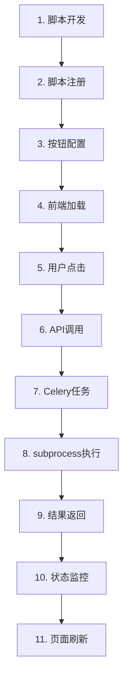

# 方案1 - Celery完整流程详解

## 🎯 概述

方案1采用"统一任务执行器 + subprocess"架构，所有脚本都通过同一个Celery任务执行器来运行，实现了脚本管理的统一化和标准化。

## 📋 完整流程图



## 🔧 详细流程步骤

### 1. 脚本开发阶段

#### 📁 脚本位置
```
server/celery_app/
├── print_test_script.py    # 方案1版本的打印测试脚本
├── example_script.py       # 示例脚本
└── your_script.py          # 新开发的脚本
```

#### 📝 脚本标准格式
```python
#!/usr/bin/env python3
import os
import json
import sys
from datetime import datetime

def get_script_parameters():
    """从环境变量获取脚本参数"""
    try:
        params_str = os.environ.get('SCRIPT_PARAMETERS', '{}')
        return json.loads(params_str)
    except json.JSONDecodeError:
        return {}

def main():
    """主要业务逻辑"""
    try:
        # 获取参数
        parameters = get_script_parameters()
        page_context = os.environ.get('PAGE_CONTEXT', 'unknown')
        script_name = os.environ.get('SCRIPT_NAME', 'unknown')
        
        # 业务逻辑处理
        result = your_business_logic(parameters)
        
        # 标准JSON输出格式
        output = {
            'status': 'success',
            'message': '脚本执行成功',
            'data': result,
            'metadata': {
                'script_name': script_name,
                'execution_time': datetime.now().isoformat()
            }
        }
        
        print(json.dumps(output, ensure_ascii=False, indent=2))
        
    except Exception as e:
        error_output = {
            'status': 'error',
            'message': str(e),
            'error_type': type(e).__name__
        }
        print(json.dumps(error_output, ensure_ascii=False))
        sys.exit(1)

if __name__ == '__main__':
    main()
```

### 2. 脚本注册阶段

#### 🔄 自动注册
```bash
cd server
python manage.py register_scripts --force
```

#### 📊 注册过程
```python
# register_scripts.py 执行过程:
1. 扫描 celery_app/ 目录下的 .py 文件
2. 分析脚本内容和参数
3. 创建 Script 数据库记录
4. 设置参数模式和元数据
```

#### 🗄️ 数据库记录
```sql
-- Script 表记录示例
INSERT INTO c_scripts (
    name,                    -- 'print_test_script'
    description,             -- '打印测试脚本 - 方案1版本'
    script_path,             -- 'celery_app/print_test_script.py'
    script_type,             -- 'data_processing'
    parameters_schema,       -- '{"greeting": {"type": "string", "default": "你好！"}}'
    is_active               -- true
);
```

### 3. 按钮配置阶段

#### 📝 配置文件
```json
// button_configs.json
[
    {
        "page_route": "/scanDevUpdate",
        "script_name": "print_test_script",
        "button_text": "运行Print测试",
        "position": "top-right",
        "button_style": {
            "type": "primary",
            "size": "default"
        },
        "display_order": 1
    }
]
```

#### 🔧 配置应用
```bash
cd server
python manage.py setup_page_scripts
```

#### 🗄️ 页面配置数据库记录
```sql
-- PageScriptConfig 表记录
INSERT INTO page_script_configs (
    script_id,              -- 关联 Script 表的 ID
    page_route,             -- '/scanDevUpdate'
    button_text,            -- '运行Print测试'
    button_style,           -- '{"type": "primary", "size": "default"}'
    position,               -- 'top-right'
    display_order,          -- 1
    is_enabled             -- true
);
```

### 4. 前端加载阶段

#### 🌐 页面组件结构
```vue
<!-- scanDevUpdate.vue -->
<template>
  <div>
    <ScriptManagerLayout page-route="/scanDevUpdate" ref="scriptManager">
      <!-- 页面内容 -->
      <el-tabs>...</el-tabs>
    </ScriptManagerLayout>
  </div>
</template>
```

#### 📡 API调用流程
```typescript
// useScriptManager.ts
const loadScripts = async () => {
  // 1. 调用 GET /myapp/admin/celery/scripts?page_route=/scanDevUpdate
  const response = await listScriptsApi({ page_route: pageRoute })
  
  // 2. 处理返回数据
  availableScripts.value = data.scripts
  pageConfigs.value = data.page_configs
  allConfiguredScripts.value = mergeScriptsWithConfigs(scripts, configs)
}
```

#### 🎨 按钮渲染
```vue
<!-- ScriptButtons.vue -->
<template>
  <div v-for="script in filteredScripts" :key="script.id">
    <el-button 
      :type="script.button_style.type"
      :loading="script.loading"
      @click="executeScript(script, script.tasks[0])"
    >
      {{ script.button_text }}
    </el-button>
  </div>
</template>
```

### 5. 用户点击阶段

#### 🖱️ 点击事件处理
```typescript
// ScriptManagerLayout.vue
const handleScriptExecution = (script: any) => {
  if (script.tasks && script.tasks.length > 0) {
    const task = script.tasks[0] // 方案1每个脚本只有一个统一执行任务
    executeScript(script, task)
  }
}
```

#### 📋 参数准备
```typescript
// useScriptManager.ts
const executeScript = async (script: any, task: any) => {
  const executionData = {
    script_id: script.id,                           // 脚本ID
    parameters: getDefaultParameters(task.parameters), // 从参数模式获取默认值
    page_context: pageRoute                         // 页面上下文
  }
}
```

### 6. API调用阶段

#### 📡 HTTP请求
```http
POST /myapp/admin/celery/execute-script
Content-Type: application/json

{
  "script_id": 1,
  "parameters": {
    "greeting": "你好！",
    "author": "阿青"
  },
  "page_context": "/scanDevUpdate"
}
```

#### 🔄 后端处理流程
```python
# celery_views.py
def execute_script_task(request):
    # 1. 解析请求参数
    data = json.loads(request.body)
    script_id = data.get('script_id')
    parameters = data.get('parameters', {})
    page_context = data.get('page_context', 'api')
    
    # 2. 验证脚本存在
    script = Script.objects.get(id=script_id, is_active=True)
    
    # 3. 创建任务执行记录
    task_execution = TaskExecution.objects.create(
        script=script,
        user_id=1,
        page_context=page_context,
        parameters=parameters,
        status='PENDING'
    )
    
    # 4. 调用方案1统一执行器
    celery_task = execute_python_script.delay(
        task_execution.id,
        script_id,
        parameters,
        1,  # user_id
        page_context
    )
    
    # 5. 更新任务ID并返回
    task_execution.task_id = celery_task.id
    task_execution.save()
    
    return JsonResponse({
        'success': True,
        'task_id': celery_task.id,
        'execution_id': task_execution.id
    })
```

### 7. Celery任务执行阶段

#### 🚀 统一任务执行器
```python
# tasks.py
@shared_task(bind=True)
def execute_python_script(self, task_execution_id, script_id, parameters, user_id, page_context):
    """方案1统一任务执行器"""
    
    # 1. 获取任务记录并更新状态
    task_execution = TaskExecution.objects.get(id=task_execution_id)
    task_execution.status = 'STARTED'
    task_execution.started_at = timezone.now()
    task_execution.save()
    
    # 2. 获取脚本配置
    script = Script.objects.get(id=script_id)
    
    # 3. 记录资源使用情况
    start_time = timezone.now()
    process_info = psutil.Process()
    initial_memory = process_info.memory_info().rss / 1024 / 1024
    
    # 4. 执行脚本
    result = run_script(script.script_path, parameters, page_context, script.name)
    
    # 5. 更新执行结果
    execution_time = (timezone.now() - start_time).total_seconds()
    task_execution.status = 'SUCCESS'
    task_execution.result = result
    task_execution.execution_time = execution_time
    task_execution.completed_at = timezone.now()
    task_execution.save()
```

### 8. subprocess执行阶段

#### 🔧 脚本执行准备
```python
# tasks.py
def run_python_file(script_path, parameters, page_context, script_name):
    # 1. 准备环境变量
    env = os.environ.copy()
    env['SCRIPT_PARAMETERS'] = json.dumps(parameters, ensure_ascii=False)
    env['PAGE_CONTEXT'] = page_context
    env['SCRIPT_NAME'] = script_name
    env['EXECUTION_ID'] = str(timezone.now().timestamp())
    
    # 2. 执行subprocess
    result = subprocess.run(
        [sys.executable, script_path],
        capture_output=True,
        text=True,
        env=env,
        timeout=540,  # 9分钟超时
        cwd=os.path.dirname(script_path)
    )
    
    # 3. 处理执行结果
    if result.returncode != 0:
        raise RuntimeError(f"脚本执行失败: {result.stderr}")
    
    # 4. 解析JSON输出
    output_data = json.loads(result.stdout)
    return output_data
```

#### 📋 脚本执行环境
```bash
# 脚本执行时的环境变量
SCRIPT_PARAMETERS='{"greeting": "你好！", "author": "阿青"}'
PAGE_CONTEXT='/scanDevUpdate'
SCRIPT_NAME='print_test_script'
EXECUTION_ID='1704038400.123456'
```

### 9. 结果返回阶段

#### 📤 脚本输出处理
```python
# print_test_script.py 输出示例
{
  "status": "success",
  "message": "print_test脚本执行成功！你好！我叫阿青",
  "timestamp": 1704038400.123456,
  "data": {
    "greeting": "你好！",
    "author": "阿青",
    "task_type": "print_test",
    "page_context": "/scanDevUpdate"
  },
  "metadata": {
    "script_name": "print_test_script",
    "execution_time": "2024-01-01T00:00:00.123456",
    "version": "2.0.0",
    "method": "subprocess_execution"
  }
}
```

#### 🗄️ 结果存储
```python
# 存储到 ScanDevUpdate_scanResult 表
scan_result = ScanDevUpdate_scanResult.objects.create(
    scandevresult_filename=f"{script_name}_执行结果_{task_id[:8]}.json",
    scandevresult_time=timezone.now(),
    director="系统自动",
    remark=f"脚本执行结果 - {script_description}",
    scandevresult_content=json.dumps(task_result, ensure_ascii=False, indent=2),
    status='0',
    result_type='script',
    script_name=script_name,
    task_id=task_id,
    execution_time=execution_time,
    script_output=task_result.get('message', ''),
    error_message=None
)
```

### 10. 状态监控阶段

#### 🔍 前端轮询
```typescript
// useScriptManager.ts
const monitorTaskStatus = async (script: any, taskId: string, executionId?: string) => {
  const maxAttempts = 30
  let attempts = 0
  
  const poll = async () => {
    attempts++
    // 调用 GET /myapp/admin/celery/script-task-result?task_id=xxx&execution_id=xxx
    const result = await getScriptTaskResultApi(taskId, executionId)
    
    if (result.ready) {
      script.loading = false
      if (result.success) {
        message.success(`${script.name} 执行成功！`)
        emitRefreshData() // 触发页面数据刷新
      } else {
        message.error(`${script.name} 执行失败: ${result.error}`)
      }
    } else if (attempts < maxAttempts) {
      setTimeout(poll, 2000) // 2秒后重试
    }
  }
  
  setTimeout(poll, 1000) // 1秒后开始查询
}
```

#### 📊 状态查询API
```python
# celery_views.py
def get_script_task_result(request):
    task_id = request.GET.get('task_id')
    execution_id = request.GET.get('execution_id')
    
    # 1. 获取Celery任务状态
    result = AsyncResult(task_id, app=celery_app)
    
    # 2. 获取数据库执行记录
    task_execution = TaskExecution.objects.get(id=execution_id)
    
    # 3. 同步状态
    if result.ready() and task_execution.status in ['PENDING', 'STARTED']:
        if result.successful():
            task_execution.status = 'SUCCESS'
            task_execution.result = json.dumps(result.result)
        else:
            task_execution.status = 'FAILURE'
            task_execution.error_message = str(result.result)
        task_execution.save()
    
    # 4. 返回统一格式
    return JsonResponse({
        'ready': result.ready(),
        'success': result.successful() if result.ready() else None,
        'result': result.result if result.ready() and result.successful() else None,
        'error': str(result.result) if result.ready() and not result.successful() else None
    })
```

### 11. 页面刷新阶段

#### 🔄 数据刷新回调
```typescript
// scanDevUpdate.vue
onMounted(() => {
  getDataList();
  
  // 注册脚本执行完成后的数据刷新回调
  if (scriptManager.value) {
    scriptManager.value.onDataRefresh(() => {
      console.log('脚本执行完成，刷新扫描结果数据...')
      getDataList(); // 重新加载表格数据
    });
  }
});
```

#### 📊 表格数据更新
```typescript
const getDataList = () => {
  data.loading = true;
  listApi({ keyword: data.keyword })
    .then((res) => {
      // 处理返回的扫描结果数据，包括新的脚本执行结果
      data.scanResult_dataList = res.data;
    });
}
```

## 🎯 关键技术点

### 1. 统一执行器设计
- **单一入口**: 所有脚本都通过 `execute_python_script` 任务执行
- **参数标准化**: 通过环境变量传递JSON格式参数
- **结果标准化**: 脚本输出统一JSON格式

### 2. 进程隔离机制
- **subprocess调用**: 每个脚本在独立进程中运行
- **环境隔离**: 脚本间不会相互影响
- **资源监控**: 跟踪内存和CPU使用情况

### 3. 异步任务管理
- **Celery集成**: 利用Celery的分布式任务队列
- **状态跟踪**: 实时监控任务执行状态
- **错误处理**: 完整的异常处理和重试机制

### 4. 数据库设计
- **Script模型**: 脚本元数据管理
- **TaskExecution模型**: 执行记录和状态
- **PageScriptConfig模型**: 页面按钮配置

## 🔧 部署和维护

### 启动服务
```bash
# 1. 启动Redis
redis-server

# 2. 启动Celery Worker
cd server
celery -A celery_app worker --loglevel=info

# 3. 启动Django服务器
cd server
python manage.py runserver
```

### 管理命令
```bash
# 注册新脚本
python manage.py register_scripts --force

# 设置页面配置
python manage.py setup_page_scripts

# 一键设置
python run_scheme1_setup.py
```

## 🎉 总结

方案1通过统一的任务执行器实现了：
- **简化的脚本开发**: 标准化的输入输出格式
- **统一的执行管理**: 所有脚本通过同一个Celery任务处理
- **完整的监控体系**: 从执行到结果的全程跟踪
- **灵活的配置管理**: 通过数据库配置脚本和按钮
- **良好的用户体验**: 实时状态更新和自动数据刷新

这种架构既保持了Celery异步任务的优势，又实现了脚本开发的独立性和灵活性。
