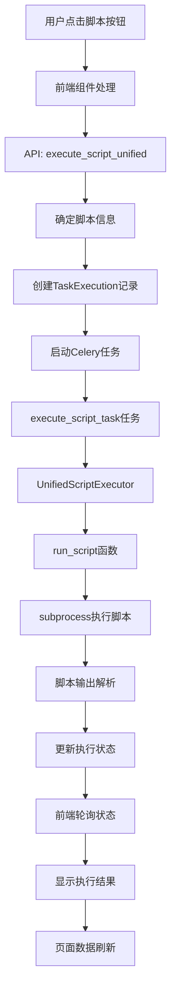

# 脚本执行完整流程详解

## 概述

本文档详细说明了脚本执行的完整流程，从用户点击按钮到脚本执行完成的全过程。系统采用统一的脚本执行架构，通过UnifiedScriptExecutor支持所有类型的脚本执行。

## 执行流程图



## 详细执行流程

### 1. 前端用户交互阶段

#### 1.1 用户点击脚本按钮
```typescript
// ScriptManagerLayout.vue
const handleScriptExecution = (script: any) => {
  if (script.tasks && script.tasks.length > 0) {
    const task = script.tasks[0]
    executeScript(script, task)
  }
}
```

#### 1.2 统一脚本执行
```typescript
// useScriptManager.ts
const executeScript = async (script: any, task: any) => {
  // 统一的脚本执行流程
  const executionData = {
    script_id: script.id,      // 数据库脚本ID（优先）
    script_name: script.name,  // 脚本名称
    parameters: getDefaultParameters(task.parameters),
    page_context: pageRoute
  }
  
  // 调用统一API
  const response = await fetch('/api/execute-script/', {
    method: 'POST',
    headers: { 'Content-Type': 'application/json' },
    body: JSON.stringify(executionData)
  })
}
```

### 2. API调用阶段

#### 2.1 统一脚本执行API调用
```http
POST /myapp/api/execute-script/
Content-Type: application/json

{
  "script_id": 1,                    // 可选：数据库脚本ID（优先）
  "script_name": "scanner_file",     // 可选：脚本名称
  "script_path": "/path/to/script",  // 可选：脚本路径
  "parameters": {
    "directory": "C:\\temp",
    "file_extensions": [".txt", ".log"],
    "recursive": true
  },
  "page_context": "/scanDevUpdate"
}
```

### 3. 后端处理阶段

#### 3.1 DRF ViewSet处理流程
```python
# celery_views.py - ScriptExecutionViewSet.execute
@action(detail=False, methods=['post'])
def execute(self, request):
    # 1. 解析请求参数
    script_id = request.data.get('script_id')
    script_name = request.data.get('script_name')
    script_path = request.data.get('script_path')
    parameters = request.data.get('parameters', {})
    page_context = request.data.get('page_context', '')
    
    # 2. 确定脚本信息
    script_info = None
    if script_id:
        # 从数据库获取脚本信息
        script = get_object_or_404(Script, id=script_id, is_active=True)
        script_info = {
            'id': script.id,
            'name': script.name,
            'path': script.script_path
        }
    elif script_name and script_path:
        # 直接使用提供的脚本信息
        script_info = {
            'name': script_name,
            'path': script_path
        }
    elif script_name:
        # 根据脚本名称构建路径
        script_path = os.path.join(settings.BASE_DIR, 'celery_app', script_name)
        if not script_name.endswith('.py'):
            script_path += '.py'
        
        script_info = {
            'name': script_name,
            'path': script_path
        }
    
    # 3. 创建任务执行记录
    script_obj = None
    if script_info.get('id'):
        script_obj = Script.objects.get(id=script_info['id'])
    
    task_execution = TaskExecution.objects.create(
        task_id='',  # 先创建，稍后更新
        script=script_obj,  # 可能为None
        user=request.user,
        page_context=page_context,
        parameters=parameters,
        status='PENDING'
    )
    
    # 4. 启动统一Celery任务
    celery_task = execute_script_task.delay(
        task_execution.id,
        script_info,
        parameters,
        request.user.id,
        page_context
    )
    
    # 5. 更新任务ID
    task_execution.task_id = celery_task.id
    task_execution.save()
    
    return Response({
        'success': True,
        'task_id': celery_task.id,
        'execution_id': task_execution.id,
        'script_name': script_info['name'],
        'message': '脚本已启动执行'
    })
```


### 4. Celery任务执行阶段

#### 4.1 统一脚本Celery任务
```python
# celery_views.py - execute_script_task
@shared_task(bind=True)
def execute_script_task(self, task_execution_id, script_info, parameters, user_id, page_context):
    """统一脚本执行器 - 支持所有类型的脚本"""
    from .script_executor_base import UnifiedScriptExecutor
    
    logger.info(f"开始执行脚本: task_id={self.request.id}, script={script_info.get('name', 'unknown')}")
    
    try:
        # 使用统一执行器
        result = UnifiedScriptExecutor.execute_unified(
            task_execution_id,
            script_info,
            parameters,
            user_id,
            page_context
        )
        
        return result.to_dict()
        
    except Exception as exc:
        logger.error(f"脚本执行失败: {exc}")
        
        # 重试机制
        if self.request.retries < 3:
            logger.info(f"任务重试: 第 {self.request.retries + 1} 次")
            raise self.retry(exc=exc, countdown=60, max_retries=3)
        
        # 返回错误结果
        return {
            'status': 'error',
            'error': str(exc),
            'script_name': script_info.get('name', 'unknown')
        }
```


### 5. 脚本实际执行阶段

#### 5.1 run_script函数
```python
def run_script(script_path, parameters, page_context, script_name):
    """运行脚本的核心逻辑"""
    # 1. 验证脚本路径
    if not os.path.exists(script_path):
        raise FileNotFoundError(f"脚本文件不存在: {script_path}")
    
    # 2. 确保脚本路径是绝对路径
    if not os.path.isabs(script_path):
        script_path = os.path.join(settings.BASE_DIR, script_path)
    
    # 3. 根据文件类型执行不同的处理
    if script_path.endswith('.py'):
        return run_python_file(script_path, parameters, page_context, script_name)
    elif script_path.endswith('.sh'):
        return run_shell_script(script_path, parameters, page_context, script_name)
    else:
        raise ValueError(f"不支持的脚本类型: {os.path.splitext(script_path)[1]}")
```

#### 5.2 Python脚本执行
```python
def run_python_file(script_path, parameters, page_context, script_name):
    """运行Python文件"""
    # 1. 准备环境变量
    env = os.environ.copy()
    env['SCRIPT_PARAMETERS'] = json.dumps(parameters, ensure_ascii=False)
    env['PAGE_CONTEXT'] = page_context
    env['SCRIPT_NAME'] = script_name
    env['EXECUTION_ID'] = str(timezone.now().timestamp())
    
    # 2. 执行脚本
    result = subprocess.run(
        [sys.executable, script_path],
        capture_output=True,
        text=True,
        env=env,
        timeout=540,  # 9分钟超时
        cwd=os.path.dirname(script_path)
    )
    
    # 3. 检查执行结果
    if result.returncode != 0:
        error_msg = f"脚本执行失败 (返回码: {result.returncode})\nSTDERR: {result.stderr}\nSTDOUT: {result.stdout}"
        raise RuntimeError(error_msg)
    
    # 4. 解析输出
    try:
        output_data = json.loads(result.stdout) if result.stdout.strip() else {}
    except json.JSONDecodeError:
        # 如果不是JSON，作为普通文本处理
        output_data = {
            'type': 'text',
            'content': result.stdout,
            'stderr': result.stderr,
            'message': '脚本执行完成，输出为文本格式'
        }
    
    # 5. 确保输出包含必要的元数据
    output_data.setdefault('script_name', script_name)
    output_data.setdefault('execution_time', timezone.now().isoformat())
    if 'status' not in output_data:
        output_data['status'] = 'success'
    
    return output_data
```

### 6. 脚本内部执行阶段

#### 6.1 基于模板系统的脚本执行
```python
# 示例：scanner_file.py
from script_base import create_simple_script

def main_logic(script):
    """主要业务逻辑函数"""
    # 1. 获取参数
    directory = script.get_parameter('directory', '.')
    file_extensions = script.get_parameter('file_extensions', ['.txt'])
    recursive = script.get_parameter('recursive', True)
    
    script.info("开始扫描文件")
    
    # 2. 执行业务逻辑
    try:
        # 文件扫描逻辑
        found_files = scan_files(directory, file_extensions, recursive)
        
        # 3. 返回成功结果
        return script.success_result(
            f"扫描完成，找到 {len(found_files)} 个文件",
            {'files': found_files, 'count': len(found_files)}
        )
        
    except Exception as e:
        script.error(f"扫描失败: {e}")
        return script.error_result(f"扫描失败: {e}", "ScanError")

if __name__ == '__main__':
    create_simple_script('scanner_file', main_logic)
```

#### 6.2 脚本输出格式
```json
{
  "status": "success",
  "message": "扫描完成，找到 15 个文件",
  "timestamp": 1704038400.123456,
  "data": {
    "files": [
      {"name": "file1.txt", "path": "/path/to/file1.txt", "size": 1024},
      {"name": "file2.log", "path": "/path/to/file2.log", "size": 2048}
    ],
    "count": 15,
    "directory": "/path/to/scan",
    "extensions": [".txt", ".log"]
  },
  "metadata": {
    "script_name": "scanner_file",
    "execution_time": "2024-01-01T00:00:00.123456",
    "execution_duration": 2.345,
    "version": "1.0.0",
    "method": "subprocess_execution"
  }
}
```

### 7. 状态监控和结果返回阶段

#### 7.1 前端状态轮询
```typescript
// useScriptManager.ts
const monitorTaskStatus = async (script: any, taskId: string, executionId?: string) => {
  const maxAttempts = 30
  let attempts = 0
  
  const poll = async () => {
    attempts++
    
    // 调用状态查询API
    const result = await getScriptTaskResultApi(taskId, executionId)
    
    if (result.ready) {
      script.loading = false
      if (result.success) {
        message.success(`${script.name} 执行成功！`)
        emitRefreshData() // 触发页面数据刷新
      } else {
        message.error(`${script.name} 执行失败: ${result.error}`)
      }
    } else if (attempts < maxAttempts) {
      setTimeout(poll, 2000) // 2秒后重试
    } else {
      script.loading = false
      message.error('任务执行超时')
    }
  }
  
  setTimeout(poll, 1000) // 1秒后开始查询
}
```

#### 7.2 状态查询API
```python
# celery_views.py - get_script_task_result
def get_script_task_result(request):
    task_id = request.GET.get('task_id')
    execution_id = request.GET.get('execution_id')
    
    # 1. 获取Celery任务状态
    result = AsyncResult(task_id, app=celery_app)
    
    # 2. 获取数据库执行记录
    task_execution = TaskExecution.objects.get(id=execution_id)
    
    # 3. 同步状态
    if result.ready() and task_execution.status in ['PENDING', 'STARTED']:
        if result.successful():
            task_execution.status = 'SUCCESS'
            task_execution.result = json.dumps(result.result)
        else:
            task_execution.status = 'FAILURE'
            task_execution.error_message = str(result.result)
        task_execution.save()
    
    # 4. 返回统一格式
    return JsonResponse({
        'ready': result.ready(),
        'success': result.successful() if result.ready() else None,
        'result': result.result if result.ready() and result.successful() else None,
        'error': str(result.result) if result.ready() and not result.successful() else None,
        'status': task_execution.status,
        'execution_time': task_execution.execution_time,
        'memory_usage': task_execution.memory_usage
    })
```

### 8. 结果存储和页面刷新阶段

#### 8.1 结果存储到数据库
```python
# 在脚本执行成功后，结果会自动存储到TaskExecution表
task_execution.result = result  # JSON格式的脚本输出
task_execution.status = 'SUCCESS'
task_execution.execution_time = execution_time
task_execution.memory_usage = memory_usage
task_execution.completed_at = timezone.now()
task_execution.save()
```

#### 8.2 页面数据刷新
```typescript
// scanDevUpdate.vue
onMounted(() => {
  getDataList();
  
  // 注册脚本执行完成后的数据刷新回调
  if (scriptManager.value) {
    scriptManager.value.onDataRefresh(() => {
      console.log('脚本执行完成，刷新扫描结果数据...')
      getDataList(); // 重新加载表格数据
    });
  }
});

const getDataList = () => {
  data.loading = true;
  listApi({ keyword: data.keyword })
    .then((res) => {
      // 处理返回的扫描结果数据，包括新的脚本执行结果
      data.scanResult_dataList = res.data;
    });
}
```

## 关键特性

### 1. 两种执行模式
- **传统脚本执行**：基于数据库中的Script记录，使用script_id
- **动态脚本执行**：基于script_configs.json配置，使用script_name

### 2. 统一的subprocess执行
- 所有脚本都通过subprocess在独立进程中执行
- 支持Python和Shell脚本
- 9分钟超时限制
- 完整的错误处理和日志记录

### 3. 环境变量传递
- `SCRIPT_PARAMETERS`: JSON格式的脚本参数
- `PAGE_CONTEXT`: 页面上下文信息
- `SCRIPT_NAME`: 脚本名称
- `EXECUTION_ID`: 执行ID

### 4. 状态监控
- 实时状态轮询
- 完整的执行记录
- 资源使用监控（内存、执行时间）
- 错误信息记录

### 5. 结果处理
- 标准JSON输出格式
- 自动元数据添加
- 数据库持久化存储
- 前端自动刷新

## 故障排除

### 常见问题

1. **脚本执行失败**
   - 检查脚本文件是否存在
   - 验证脚本语法是否正确
   - 查看Celery Worker日志

2. **参数传递失败**
   - 检查JSON格式是否正确
   - 验证参数名称是否匹配
   - 确认默认值设置

3. **超时问题**
   - 检查脚本执行时间是否超过540秒
   - 优化脚本性能
   - 考虑分批处理

4. **状态轮询失败**
   - 检查Redis连接状态
   - 验证Celery任务ID
   - 查看网络连接

这个完整的执行流程确保了脚本的可靠执行、状态监控和结果处理，为用户提供了良好的使用体验。
