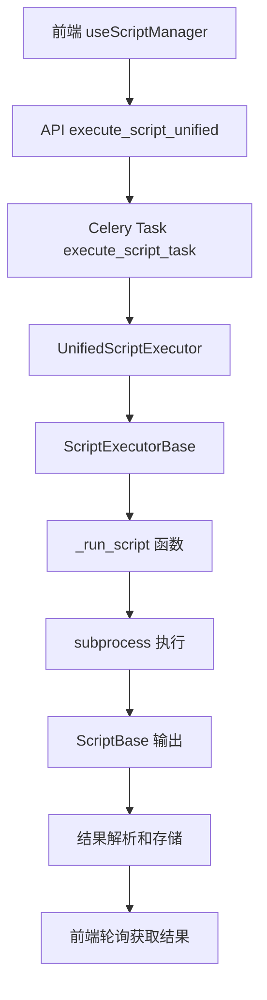

# 脚本执行底层逻辑详解

## 📋 概述

本文档详细说明了统一脚本执行器的底层运行逻辑，包括脚本执行流程、参数传递、结果处理和错误机制。系统已完全采用UnifiedScriptExecutor统一架构，消除了传统脚本和动态脚本的区分。

## 🏗️ 整体架构

### 核心组件



### 关键类和方法

1. **UnifiedScriptExecutor**: 统一脚本执行器
2. **ScriptExecutorBase**: 脚本执行基类
3. **TaskExecutionManager**: 任务状态管理器
4. **ResourceMonitor**: 资源监控器
5. **ScriptExecutionResult**: 执行结果封装类

## 🔄 详细执行流程

### 1. 前端发起执行

#### 1.1 用户交互
```typescript
// web/src/composables/useScriptManager.ts
const executeScript = async (script: any, task: any) => {
  // 构建统一的执行请求体
  const executionData = {
    script_id: script.id,      // 数据库脚本ID
    script_name: script.name,  // 脚本名称
    parameters: getDefaultParameters(task.parameters),
    page_context: pageRoute
  }
  
  // 调用统一API
  const response = await fetch(`${BASE_URL}/myapp/api/execute-script/`, {
    method: 'POST',
    headers: { 'Content-Type': 'application/json' },
    body: JSON.stringify(executionData)
  })
}
```

#### 1.2 参数处理
- **script_id**: 优先使用数据库脚本ID
- **script_name**: 脚本名称，用于标识和日志
- **parameters**: 脚本执行参数，通过 `getDefaultParameters()` 处理
- **page_context**: 页面上下文，标识调用来源

### 2. 后端API处理

#### 2.1 DRF ViewSet处理
```python
# server/myapp/views/celery_views.py
@action(detail=False, methods=['post'])
def execute_script(self, request):
    script_id = request.data.get('script_id')
    script_name = request.data.get('script_name')
    script_path = request.data.get('script_path')
    parameters = request.data.get('parameters', {})
    page_context = request.data.get('page_context', '')
    
    # 确定脚本信息
    script_info = None
    
    if script_id:
        # 从数据库获取脚本信息
        script = get_object_or_404(Script, id=script_id, is_active=True)
        script_info = {
            'id': script.id,
            'name': script.name,
            'path': script.script_path
        }
    elif script_name and script_path:
        # 直接使用提供的脚本信息
        script_info = {
            'name': script_name,
            'path': script_path
        }
    elif script_name:
        # 根据脚本名称构建路径
        script_path = os.path.join(settings.BASE_DIR, 'celery_app', script_name)
        if not script_name.endswith('.py'):
            script_path += '.py'
        
        script_info = {
            'name': script_name,
            'path': script_path
        }
```

#### 2.2 脚本信息确定逻辑
1. **优先级1**: `script_id` - 从数据库获取完整脚本信息
2. **优先级2**: `script_name` + `script_path` - 直接使用提供的路径
3. **优先级3**: `script_name` - 根据名称构建默认路径
4. **验证**: 确保脚本文件存在

#### 2.3 任务记录创建
```python
# 创建任务执行记录
script_obj = None
if script_info.get('id'):
    script_obj = Script.objects.get(id=script_info['id'])

task_execution = TaskExecution.objects.create(
    task_id='',  # 先创建，稍后更新
    script=script_obj,  # 可能为None
    user=request.user,
    page_context=page_context,
    parameters=parameters,
    status='PENDING'
)
```

### 3. Celery异步任务执行

#### 3.1 任务启动
```python
# 启动统一脚本执行任务
celery_task = execute_script_task.delay(
    task_execution.id,
    script_info,
    parameters,
    request.user.id,
    page_context
)

# 更新任务ID
task_execution.task_id = celery_task.id
task_execution.save()
```

#### 3.2 Celery任务定义
```python
@shared_task(bind=True)
def execute_script_task(self, task_execution_id, script_info, parameters, user_id, page_context):
    """
    统一脚本执行器 - 支持所有类型的脚本
    
    参数:
    -----
    task_execution_id : int
        任务执行记录ID
    script_info : dict
        脚本信息，包含name和path
    parameters : dict
        脚本执行参数
    user_id : int
        执行用户ID
    page_context : str
        页面上下文
        
    返回:
    -----
    dict : 执行结果
    """
    from .script_executor_base import UnifiedScriptExecutor
    
    logger.info(f"开始执行脚本: task_id={self.request.id}, script={script_info.get('name', 'unknown')}")
    
    try:
        # 使用统一执行器
        result = UnifiedScriptExecutor.execute(
            task_execution_id=task_execution_id,
            script_info=script_info,
            parameters=parameters,
            user_id=user_id,
            page_context=page_context
        )
        
        return result.to_dict()
        
    except Exception as exc:
        logger.error(f"脚本执行失败: {exc}")
        
        # 重试机制
        if self.request.retries < 3:
            logger.info(f"任务重试: 第 {self.request.retries + 1} 次")
            raise self.retry(exc=exc, countdown=60, max_retries=3)
        
        # 返回错误结果
        return {
            'status': 'error',
            'error': str(exc),
            'script_name': script_info.get('name', 'unknown')
        }
```

### 4. 统一执行器处理

#### 4.1 UnifiedScriptExecutor
```python
class UnifiedScriptExecutor(ScriptExecutorBase):
    """统一脚本执行器 - 支持所有类型的脚本执行"""
    
    def __init__(self, task_execution_id: int, script_info: Dict, parameters: Dict, 
                 user_id: int, page_context: str):
        super().__init__(task_execution_id, user_id, page_context)
        self.script_info = script_info
        self.parameters = parameters
    
    def execute_script(self) -> Any:
        """执行脚本的统一方法"""
        from .celery_views import run_script
        
        script_name = self.script_info['name']
        script_path = self.script_info['path']
        
        logger.info(f"Executing script: {script_name} ({script_path})")
        
        return run_script(script_path, self.parameters, self.page_context, script_name)
```

#### 4.2 ScriptExecutorBase基类
```python
class ScriptExecutorBase:
    """脚本执行基类 - 统一的脚本执行逻辑"""
    
    def execute(self, script_executor_func: Callable) -> ScriptExecutionResult:
        """执行脚本的统一入口"""
        try:
            # 开始监控
            self.resource_monitor.start_monitoring()
            
            # 标记任务开始
            self.task_execution_manager.mark_started()
            
            # 执行脚本
            result = script_executor_func()
            
            # 停止监控
            execution_time, memory_usage = self.resource_monitor.stop_monitoring()
            
            # 标记任务成功
            self.task_execution_manager.mark_success(
                result=result,
                execution_time=execution_time,
                memory_usage=memory_usage
            )
            
            # 返回成功结果
            return ScriptExecutionResult(
                status='success',
                result=result,
                execution_time=execution_time,
                memory_usage=memory_usage,
                script_name=self.script_info.get('name')
            )
            
        except Exception as exc:
            # 错误处理逻辑...
```

### 5. 脚本实际执行

#### 5.1 _run_script函数
```python
def _run_script(self, script_path, parameters, page_context, script_name):
    """
    运行脚本的核心逻辑 - 统一脚本执行入口
    
    此函数是脚本执行的核心调度器，负责：
    1. 验证脚本文件存在性
    2. 处理相对路径和绝对路径
    3. 根据文件类型分发到对应的执行器
    4. 提供统一的错误处理
    """
    import os
    from django.conf import settings
    
    logger.info(f"[_run_script] Starting script execution")
    logger.info(f"[_run_script] script_path: {script_path}")
    logger.info(f"[_run_script] parameters: {parameters}")
    logger.info(f"[_run_script] page_context: {page_context}")
    logger.info(f"[_run_script] script_name: {script_name}")
    
    # 1. 验证脚本文件存在性
    if not os.path.exists(script_path):
        logger.error(f"[_run_script] Script file does not exist: {script_path}")
        raise FileNotFoundError(f"脚本文件不存在: {script_path}")
    
    # 2. 处理路径：确保使用绝对路径
    if not os.path.isabs(script_path):
        script_path = os.path.join(settings.BASE_DIR, script_path)
        logger.info(f"[_run_script] Converted to absolute path: {script_path}")
    
    logger.info(f"[_run_script] 执行脚本文件: {script_path}")
    
    # 3. 根据文件类型分发到对应的执行器
    if script_path.endswith('.py'):
        logger.info(f"[_run_script] Executing Python file")
        return self._run_python_file(script_path, parameters, page_context, script_name)
    else:
        logger.error(f"[_run_script] Unsupported script type: {os.path.splitext(script_path)[1]}")
        raise ValueError(f"不支持的脚本类型: {os.path.splitext(script_path)[1]}")
```

#### 5.2 Python脚本执行
```python
def _run_python_file(self, script_path, parameters, page_context, script_name):
    """运行Python文件"""
    import subprocess
    import sys
    import json
    import os
    from django.utils import timezone
    
    logger.info(f"[_run_python_file] Starting Python file execution")
    logger.info(f"[_run_python_file] script_path: {script_path}")
    logger.info(f"[_run_python_file] script_name: {script_name}")
    
    # 准备环境变量
    env = os.environ.copy()
    env['SCRIPT_PARAMETERS'] = json.dumps(parameters, ensure_ascii=False)
    env['PAGE_CONTEXT'] = page_context
    env['SCRIPT_NAME'] = script_name
    env['EXECUTION_ID'] = str(timezone.now().timestamp())
    
    logger.info(f"准备执行Python脚本: {script_path}")
    logger.info(f"参数: {parameters}")
    
    # 执行脚本
    try:
        result = subprocess.run(
            [sys.executable, script_path],
            capture_output=True,
            text=True,
            env=env,
            timeout=540,  # 9分钟超时 (与Celery软限制对应)
            cwd=os.path.dirname(script_path)
        )
        
        logger.info(f"脚本执行完成，返回码: {result.returncode}")
        
        if result.returncode != 0:
            error_msg = f"脚本执行失败 (返回码: {result.returncode})\nSTDERR: {result.stderr}\nSTDOUT: {result.stdout}"
            logger.error(error_msg)
            raise RuntimeError(error_msg)
        
        # 尝试解析JSON输出
        try:
            output_data = json.loads(result.stdout) if result.stdout.strip() else {}
            logger.info(f"脚本输出解析成功: {type(output_data)}")
        except json.JSONDecodeError as e:
            logger.warning(f"脚本输出不是有效JSON，作为文本处理: {e}")
            # 如果不是JSON，就作为普通文本处理
            output_data = {
                'type': 'text',
                'content': result.stdout,
                'stderr': result.stderr,
                'message': '脚本执行完成，输出为文本格式'
            }
        
        # 确保输出包含必要的元数据
        if isinstance(output_data, dict):
            output_data.setdefault('script_name', script_name)
            output_data.setdefault('execution_time', timezone.now().isoformat())
            if 'status' not in output_data:
                output_data['status'] = 'success'
        
        return output_data
        
    except subprocess.TimeoutExpired:
        error_msg = f"脚本执行超时 (超过540秒): {script_path}"
        logger.error(error_msg)
        raise RuntimeError(error_msg)
    except Exception as e:
        error_msg = f"执行脚本时发生异常: {e}"
        logger.error(error_msg)
        raise
```

### 6. 脚本基础类和输出处理

#### 6.1 ScriptBase类
```python
class ScriptBase:
    """脚本基础类，提供通用功能"""
    
    def __init__(self, script_name: Optional[str] = None):
        self.script_name = script_name or self._get_script_name()
        self.parameters = self._get_parameters()  # 从环境变量获取
        self.page_context = self._get_page_context()
        self.execution_id = self._get_execution_id()
        self.start_time = time.time()
    
    def _get_parameters(self) -> Dict[str, Any]:
        """从环境变量获取脚本参数"""
        try:
            params_str = os.environ.get('SCRIPT_PARAMETERS', '{}')
            return json.loads(params_str)
        except json.JSONDecodeError:
            return {}
    
    def success_result(self, message: str, data: Optional[Dict[str, Any]] = None) -> Dict[str, Any]:
        """创建成功结果"""
        execution_time = time.time() - self.start_time
        
        result = {
            'status': 'success',
            'message': message,
            'timestamp': time.time(),
            'data': data or {},
            'metadata': {
                'script_name': self.script_name,
                'execution_time': datetime.now().isoformat(),
                'execution_duration': execution_time,
                'version': '1.0.0',
                'method': 'subprocess_execution'
            }
        }
        
        return result
    
    def output_result(self, result: Dict[str, Any]):
        """输出结果到stdout"""
        print(json.dumps(result, ensure_ascii=True, indent=2))
```

#### 6.2 脚本输出格式

**成功结果格式：**
```json
{
  "status": "success",
  "message": "脚本执行成功！",
  "timestamp": 1698321600.123,
  "data": {
    "script_name": "scanner_file",
    "execution_context": "/scanDevUpdate",
    "processed_parameters": {...}
  },
  "metadata": {
    "script_name": "scanner_file",
    "execution_time": "2023-10-27T10:00:00Z",
    "execution_duration": 2.5,
    "version": "1.0.0",
    "method": "subprocess_execution"
  }
}
```

**错误结果格式：**
```json
{
  "status": "error",
  "message": "scanner_file执行出错: 文件不存在",
  "timestamp": 1698321600.123,
  "script_name": "scanner_file",
  "error_type": "FileNotFoundError",
  "execution_duration": 0.1
}
```

### 7. 任务状态管理

#### 7.1 任务状态流转
```
PENDING → STARTED → SUCCESS/FAILURE
   ↓         ↓           ↓
创建记录   开始执行    完成执行
```

#### 7.2 TaskExecutionManager
```python
class TaskExecutionManager:
    """任务执行管理器 - 统一的任务状态管理"""
    
    def mark_started(self):
        """标记任务开始"""
        self.update_status('STARTED', started_at=timezone.now())
    
    def mark_success(self, result: Any, execution_time: float, memory_usage: float):
        """标记任务成功"""
        self.update_status(
            'SUCCESS',
            result=result,
            execution_time=execution_time,
            memory_usage=memory_usage,
            completed_at=timezone.now()
        )
    
    def mark_failure(self, error_message: str):
        """标记任务失败"""
        self.update_status(
            'FAILURE',
            error_message=error_message,
            completed_at=timezone.now()
        )
```

### 8. 资源监控

#### 8.1 ResourceMonitor
```python
class ResourceMonitor:
    """资源监控器 - 统一的资源使用监控"""
    
    def start_monitoring(self):
        """开始监控"""
        self.start_time = timezone.now()
        self.process_info = psutil.Process()
        self.start_memory = self.process_info.memory_info().rss / 1024 / 1024  # MB
    
    def stop_monitoring(self) -> Tuple[float, float]:
        """停止监控并返回执行时间和内存使用"""
        execution_time = (timezone.now() - self.start_time).total_seconds()
        
        if self.process_info:
            final_memory = self.process_info.memory_info().rss / 1024 / 1024  # MB
            memory_usage = final_memory - self.start_memory
        else:
            memory_usage = 0
        
        return execution_time, memory_usage
```

### 9. 前端轮询机制

#### 9.1 状态监控
```typescript
const monitorTaskStatus = async (script: any, taskId: string, executionId?: string) => {
  const maxAttempts = 30
  let attempts = 0
  
  const poll = async () => {
    try {
      attempts++
      const result = await getScriptTaskResultApi(taskId, executionId)
      const taskData = result.data || result
      
      if (taskData && taskData.ready) {
        // 任务完成
        script.loading = false
        
        if (taskData.success) {
          message.success(`${script.name} 执行成功！`)
          // 延迟刷新数据
          setTimeout(() => emitRefreshData(), 2000)
        } else {
          message.error(`${script.name} 执行失败: ${taskData.error}`)
        }
      } else if (attempts >= maxAttempts) {
        // 超时处理
        script.loading = false
        message.error('任务执行超时')
      } else {
        // 继续轮询
        setTimeout(poll, 2000)
      }
    } catch (error) {
      console.error('轮询任务状态失败:', error)
      script.loading = false
    }
  }
  
  poll()
}
```

### 10. 结果存储机制

#### 10.1 数据库存储
```python
def get_script_task_result(request):
    # 获取Celery任务结果
    result = AsyncResult(task_id, app=celery_app)
    
    if result.ready():
        if result.successful():
            task_result = result.result
            
            # 更新TaskExecution记录
            task_execution.status = 'SUCCESS'
            task_execution.result = json.dumps(task_result)
            task_execution.save()
            
            # 保存到ScanDevUpdate_scanResult表
            scan_result = ScanDevUpdate_scanResult.objects.create(
                scandevresult_filename=f"{script_name}_执行结果_{task_id[:8]}.json",
                scandevresult_time=timezone.now(),
                director="系统自动",
                remark=f"脚本执行结果 - {script_description}",
                scandevresult_content=json.dumps(task_result, ensure_ascii=False, indent=2),
                status='0',
                result_type='script',
                script_name=script_name,
                task_id=task_id,
                execution_time=task_execution.execution_time,
                script_output=task_result.get('message', ''),
                error_message=task_result.get('error', '') if task_result.get('status') == 'error' else None
            )
```

## 🔧 环境变量传递

### 脚本执行时的环境变量
```python
env = os.environ.copy()
env['SCRIPT_PARAMETERS'] = json.dumps(parameters, ensure_ascii=False)
env['PAGE_CONTEXT'] = page_context
env['SCRIPT_NAME'] = script_name
env['EXECUTION_ID'] = str(timezone.now().timestamp())
```

### 脚本中获取参数
```python
# 在脚本中使用ScriptBase类
from celery_app.script_base import ScriptBase

def main_logic(script: ScriptBase):
    # 获取参数
    param1 = script.get_parameter('param1', 'default_value')
    param2 = script.get_parameter('param2', 0)
    
    # 执行业务逻辑
    result = process_data(param1, param2)
    
    # 返回结果
    return script.success_result("处理完成", {'processed_count': len(result)})

if __name__ == '__main__':
    create_simple_script('my_script', main_logic)
```

## ⚠️ 错误处理和重试机制

### 1. 多层错误处理
1. **脚本级别**: `ScriptBase.run_with_error_handling()`
2. **执行器级别**: `ScriptExecutorBase.execute()`
3. **Celery级别**: `@shared_task`装饰器
4. **API级别**: `get_script_task_result()`

### 2. 重试机制
```python
# Celery任务重试
@shared_task(bind=True)
def execute_script_task(self, ...):
    try:
        # 执行逻辑
        pass
    except Exception as exc:
        # 重试机制
        if self.request.retries < 3:
            logger.info(f"任务重试: 第 {self.request.retries + 1} 次")
            raise self.retry(exc=exc, countdown=60, max_retries=3)
```

### 3. 超时处理
- **Celery软限制**: 540秒（9分钟）
- **Celery硬限制**: 600秒（10分钟）
- **subprocess超时**: 540秒

## 📊 性能监控

### 1. 执行时间监控
- 任务总执行时间
- 脚本实际运行时间
- 各阶段耗时统计

### 2. 资源使用监控
- 内存使用量（MB）
- CPU使用率
- 进程信息

### 3. 执行统计
- 处理记录数
- 成功记录数
- 失败记录数

## 🔄 数据流转

### 1. 参数流转
```
前端参数 → API参数 → Celery参数 → 环境变量 → 脚本参数
```

### 2. 结果流转
```
脚本输出 → JSON解析 → 执行结果 → 数据库存储 → 前端显示
```

### 3. 状态流转
```
PENDING → STARTED → SUCCESS/FAILURE → 前端轮询 → 用户反馈
```

## 🎯 最佳实践

### 1. 脚本开发
- 使用 `ScriptBase` 类获取参数
- 使用 `success_result()` 和 `error_result()` 返回结果
- 使用 `run_with_error_handling()` 处理异常

### 2. 参数设计
- 提供合理的默认值
- 验证参数类型和范围
- 使用清晰的参数名称

### 3. 错误处理
- 提供有意义的错误信息
- 记录详细的错误日志
- 实现优雅的降级处理

### 4. 性能优化
- 避免长时间阻塞操作
- 合理设置超时时间
- 监控资源使用情况

## 📝 总结

统一脚本执行器通过以下核心机制实现脚本的可靠执行：

1. **统一入口**: 所有脚本通过相同的API和执行器处理
2. **参数传递**: 通过环境变量安全传递参数
3. **状态管理**: 完整的任务生命周期管理
4. **资源监控**: 实时监控执行时间和资源使用
5. **错误处理**: 多层错误处理和重试机制
6. **结果存储**: 统一的结果格式和存储机制
7. **前端集成**: 简化的前端调用和状态轮询

这种架构确保了脚本执行的可靠性、可维护性和可扩展性。
