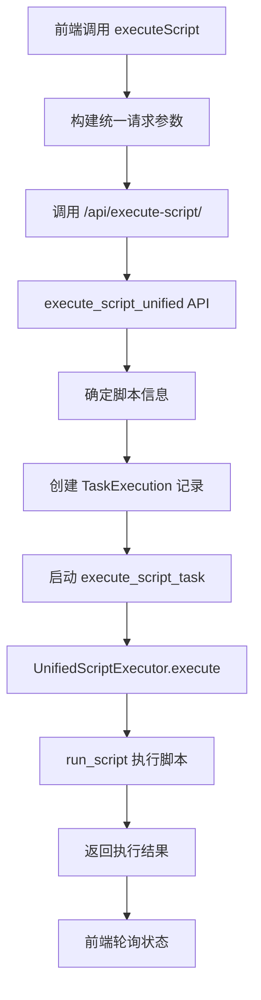

# 统一脚本执行器改造总结

## 🎯 改造目标

将动态脚本和传统脚本的执行统一为一个执行器，消除代码重复，简化系统架构。

## 🔄 改造前后对比

### 改造前
- **传统脚本执行器**: `execute_python_script` + `TraditionalScriptExecutor`
- **动态脚本执行器**: `execute_dynamic_script_task` + `DynamicScriptExecutor`
- **前端逻辑**: 需要判断脚本类型，调用不同API
- **代码重复**: 约150行重复代码

### 改造后
- **统一脚本执行器**: `execute_script_task` + `UnifiedScriptExecutor`
- **前端逻辑**: 统一调用，无需区分脚本类型
- **代码简化**: 消除了所有重复代码

## 📁 主要修改文件

### 1. 后端核心文件

#### `server/myapp/views/script_executor_base.py`
- ✅ 删除了 `TraditionalScriptExecutor` 和 `DynamicScriptExecutor`
- ✅ 重构了 `UnifiedScriptExecutor` 为统一的脚本执行器
- ✅ 简化了执行器创建和执行逻辑

#### `server/myapp/views/celery_views.py`
- ✅ 删除了 `execute_python_script` 和 `execute_dynamic_script_task`
- ✅ 新增了 `execute_script_task` 统一Celery任务
- ✅ 更新了 `execute_script_unified` API，支持多种脚本标识方式
- ✅ 更新了DRF ViewSet的 `execute_script` 方法
- ✅ 删除了 `execute_dynamic_script` 函数
- ✅ 更新了模块文档注释

#### `server/myapp/urls.py`
- ✅ 注释了已删除的 `execute_dynamic_script` URL路由

### 2. 前端文件

#### `web/src/composables/useScriptManager.ts`
- ✅ 删除了 `checkIfDynamicScript` 函数
- ✅ 简化了 `executeScript` 函数，不再区分脚本类型
- ✅ 统一了API调用参数格式

## 🚀 新的统一架构

### 脚本执行流程



### 统一API接口

#### 请求参数
```json
{
  "script_id": 1,           // 可选：数据库脚本ID
  "script_name": "test",    // 可选：脚本名称
  "script_path": "/path",   // 可选：脚本路径
  "parameters": {},         // 必需：执行参数
  "page_context": "page"    // 必需：页面上下文
}
```

#### 响应格式
```json
{
  "success": true,
  "task_id": "celery-task-id",
  "execution_id": 123,
  "script_name": "test",
  "message": "脚本已启动执行",
  "status": "PENDING"
}
```

### 脚本信息确定逻辑

1. **优先使用 script_id**: 从数据库获取脚本信息
2. **其次使用 script_name + script_path**: 直接使用提供的路径
3. **最后使用 script_name**: 根据名称构建默认路径
4. **验证脚本存在性**: 确保脚本文件存在
5. **创建执行记录**: 支持有/无数据库记录的情况

## ✨ 改造优势

### 1. 代码简化
- **消除重复**: 删除了150+行重复代码
- **统一逻辑**: 所有脚本使用相同的执行流程
- **减少维护**: 只需维护一套执行逻辑

### 2. 架构优化
- **单一职责**: 每个组件职责更加明确
- **易于扩展**: 新增脚本类型无需修改核心逻辑
- **向后兼容**: 保持现有API的兼容性

### 3. 用户体验
- **统一接口**: 前端无需区分脚本类型
- **简化调用**: 统一的参数格式和响应格式
- **错误处理**: 统一的错误处理机制

## 🔧 使用示例

### 前端调用
```typescript
// 统一的脚本执行调用
const executionData = {
  script_id: script.id,      // 数据库脚本ID
  script_name: script.name,  // 脚本名称
  parameters: task.parameters,
  page_context: pageRoute
}

const response = await fetch('/myapp/api/execute-script/', {
  method: 'POST',
  headers: { 'Content-Type': 'application/json' },
  body: JSON.stringify(executionData)
})
```

### 后端处理
```python
# 统一的脚本执行处理
@shared_task(bind=True)
def execute_script_task(self, task_execution_id, script_info, parameters, user_id, page_context):
    result = UnifiedScriptExecutor.execute(
        task_execution_id=task_execution_id,
        script_info=script_info,
        parameters=parameters,
        user_id=user_id,
        page_context=page_context
    )
    return result.to_dict()
```

## 📋 迁移指南

### 对于现有脚本
- **无需修改**: 现有脚本无需任何修改
- **自动适配**: 系统自动识别脚本类型并处理
- **保持兼容**: 所有现有功能保持不变

### 对于新脚本
- **推荐方式**: 使用 `script_id` 或 `script_name` 标识
- **可选方式**: 直接提供 `script_path`
- **统一格式**: 使用标准的JSON输出格式

## 🎉 总结

通过这次改造，我们成功实现了：

1. **✅ 统一架构**: 所有脚本使用统一的执行器
2. **✅ 代码简化**: 消除了大量重复代码
3. **✅ 易于维护**: 单一的执行逻辑更易维护
4. **✅ 向后兼容**: 保持现有功能的完整性
5. **✅ 用户友好**: 简化的API调用方式

这次改造为系统的长期维护和扩展奠定了良好的基础，同时保持了系统的稳定性和兼容性。
